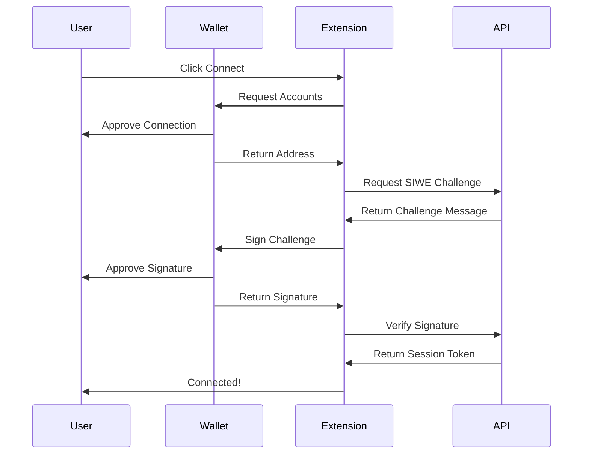

# Crypto Trading Journal - Web3 Extension

A Manifest V3 Chrome browser extension that provides custom Web3 wallet authentication for the Crypto Trading Journal application. The extension acts as an intermediary between users' wallets (MetaMask, Brave Wallet, etc.) and your application, enabling enhanced control, security, and custom authentication flows.

[](https://www.typescriptlang.org/)
[](https://developer.chrome.com/docs/extensions/mv3/intro/)
[](https://opensource.org/licenses/MIT)

## Features

- 🔐 **Custom Web3 Authentication** - SIWE (Sign-In With Ethereum) integration
- 🔄 **Resumable Authentication** - State machine persists auth flow across service worker restarts
- ⚡ **Service Worker Keep-Alive** - Multiple strategies to prevent MV3 service worker inactivity
- 🔌 **EIP-1193 Compliant** - Standard Ethereum provider interface
- 🎯 **EIP-6963 Support** - Multi-wallet discovery protocol
- 🛡️ **Enhanced Security** - Secure session management with chrome.storage.session
- 🌐 **Multi-Network Support** - Ethereum, Polygon, Arbitrum, Optimism, Base, and more
- 📊 **Health Monitoring** - Automatic service worker health checks and recovery

## Supported Browsers

- Chrome (Manifest V3)
- Brave Browser (full compatibility)
- Edge (Chromium-based)
- Opera (Chromium-based)

## Tech Stack

- **TypeScript** - Strict mode with full type safety
- **Viem** (v2.43.3) - Modern Web3 utilities
- **Zod** (v4.2.1) - Runtime type validation
- **Webpack 5** - Module bundling
- **Jest** - Unit testing
- **Playwright** - E2E testing
- **Chrome Extension APIs** - Manifest V3

## Quick Start

### Prerequisites

- Node.js 20.x or higher
- npm 9.x or higher
- Chrome/Brave browser for testing

### Installation

```bash
# Clone the repository
git clone https://github.com/your-org/crypto-web3-extension.git
cd crypto-web3-extension

# Install dependencies
npm install

# Build the extension
npm run build
```

### Development

```bash
# Watch mode for development
npm run dev

# Type checking
npm run type-check

# Linting
npm run lint
npm run lint:fix

# Run tests
npm run test:unit
npm run test:coverage
```

### Load Extension in Chrome

1. Open Chrome and navigate to `chrome://extensions`
2. Enable "Developer mode" (top right)
3. Click "Load unpacked"
4. Select the `dist/` directory from this project
5. The extension should now appear in your browser

## Architecture

### Service Worker Keep-Alive System

The extension implements a comprehensive keep-alive system to handle Manifest V3 service worker limitations (30-second inactivity timeout).

#### Key Components

```
┌─────────────────────────────────────────────────────────┐
│                  Service Worker (background.ts)          │
│  ┌──────────────┐  ┌──────────────┐  ┌──────────────┐  │
│  │ Keep-Alive   │  │ Auth State   │  │ Port         │  │
│  │ Alarms       │  │ Machine      │  │ Management   │  │
│  │ (24s cycle)  │  │ (Resumable)  │  │ (Long ops)   │  │
│  └──────────────┘  └──────────────┘  └──────────────┘  │
└─────────────────────────────────────────────────────────┘
           ↑                    ↑                    ↑
           │                    │                    │
           ├────────────────────┼────────────────────┤
           │                    │                    │
    Content Script         Popup UI          Injected Script
  (Health checks)      (Port connection)    (Wallet relay)
```

#### 1. Chrome Alarms Keep-Alive (`sw-keepalive.ts`)

Prevents service worker termination with periodic wake-ups:

```typescript
// Alarm fires every 24 seconds (under 30s threshold)
chrome.alarms.create('sw-keepalive', { periodInMinutes: 0.4 });

// Track active operations
startOperation(id, type);
// ... perform work ...
completeOperation(id);

// Wrap async operations
await withKeepAlive(id, type, async () => {
  // Your long-running operation
});
```

**Features:**
- Periodic heartbeat every 24 seconds
- Operation tracking and timeout management
- Automatic cleanup of stale operations
- Activity logging for debugging

#### 2. Port-Based Communication

Keeps service worker alive during long operations (SIWE flow, wallet interactions):

```typescript
// Popup or content script
const port = chrome.runtime.connect({ name: 'wallet-connection' });
port.postMessage(message);
port.onMessage.addListener((response) => {
  // Handle response
});
```

**Port Names:**
- `wallet-connection` - For SIWE authentication flow
- `long-operation` - For generic long-running operations

#### 3. Resumable Authentication State Machine (`auth-state-machine.ts`)

Persists authentication progress to survive service worker restarts:

```typescript
// State flow
IDLE → REQUESTING_ACCOUNTS → ACCOUNTS_RECEIVED →
GETTING_CHALLENGE → CHALLENGE_RECEIVED → SIGNING_MESSAGE →
MESSAGE_SIGNED → VERIFYING_SIGNATURE → AUTHENTICATED
```

**Features:**
- State persisted to `chrome.storage.session`
- Automatic resumption from checkpoints
- Retry logic with exponential backoff
- Error state handling

#### 4. Health Checks (`content.ts`)

Content script monitors service worker health and wakes it up when needed:

```typescript
// Periodic health check every 30 seconds
await ensureServiceWorkerHealthy();

// Auto wake-up if unresponsive
if (!isServiceWorkerHealthy) {
  // Attempt wake-up with retries
}
```

**Features:**
- Periodic checks when page visible
- Automatic wake-up on detection of inactivity
- State re-synchronization after recovery
- Visibility-based optimization

### Authentication Flow



## Project Structure

```
crypto-web3-extension/
├── src/
│   └── scripts/
│       ├── background.ts         # Service worker orchestrator
│       ├── content.ts            # Content script (page injection)
│       ├── popup.ts              # Popup UI logic
│       ├── provider.ts           # EIP-1193 provider
│       ├── injected-wallet.ts    # Page context wallet relay
│       ├── sw-keepalive.ts       # Keep-alive system ⭐ NEW
│       ├── auth-state-machine.ts # Resumable auth flow ⭐ NEW
│       ├── sw-state.ts           # State persistence
│       ├── api.ts                # API client
│       ├── config.ts             # Configuration
│       ├── types.ts              # TypeScript types
│       ├── siwe-utils.ts         # SIWE utilities
│       ├── logger.ts             # Logging
│       └── errors.ts             # Error types
├── dist/                         # Build output
├── test-ground/                  # Local testing environment
├── tests/                        # E2E tests
├── manifest.json                 # Extension manifest
├── package.json                  # Dependencies
└── webpack.config.js             # Build configuration
```

## Configuration

### Environment Variables

Copy `.env.example` to `.env.production` and configure:

```bash
# API Configuration
API_BASE_URL=https://api.cryptojournal.app
ALLOWED_ORIGINS=https://cryptojournal.app,https://*.cryptojournal.app

# Extension Configuration
EXTENSION_ID=your-extension-id
```

### Manifest Permissions

```json
{
  "permissions": [
    "storage",     // Session and local storage
    "activeTab",   // Current tab access
    "alarms"       // Keep-alive system ⭐ NEW
  ],
  "host_permissions": [
    "http://localhost:3000/*",
    "https://cryptojournal.app/*"
  ]
}
```

## API Integration

The extension requires a backend API with the following endpoints:

### POST `/api/auth/siwe/challenge`

Generate a SIWE challenge message.

**Request:**
```json
{
  "address": "0x742d35Cc6634C0532925a3b844Bc9e7595f0bEb",
  "chainId": 1,
  "accountMode": "live"
}
```

**Response:**
```json
{
  "message": "cryptojournal.app wants you to sign in...",
  "nonce": "random-nonce-123"
}
```

### POST `/api/auth/siwe/verify`

Verify the signed SIWE message.

**Request:**
```json
{
  "message": "cryptojournal.app wants you to sign in...",
  "signature": "0x...",
  "accountMode": "live"
}
```

**Response:**
```json
{
  "sessionToken": "jwt-token-here",
  "user": {
    "id": "user-id",
    "address": "0x742d35Cc6634C0532925a3b844Bc9e7595f0bEb",
    "accountMode": "live"
  }
}
```

### GET `/api/auth/session`

Validate an existing session.

**Headers:**
```
Authorization: Bearer <session-token>
```

**Response:**
```json
{
  "valid": true,
  "user": {
    "id": "user-id",
    "address": "0x742d35Cc6634C0532925a3b844Bc9e7595f0bEb",
    "accountMode": "live"
  }
}
```

## Testing

### Unit Tests

```bash
npm run test:unit
npm run test:coverage
```

### E2E Tests

```bash
npm run test
```

### Manual Testing

1. Build the extension: `npm run build`
2. Load in Chrome: `chrome://extensions` > Load unpacked > `dist/`
3. Open test page: `http://localhost:3000`
4. Click "Connect Wallet" in the extension popup
5. Verify SIWE flow completes successfully

### Debugging Service Worker

1. Open `chrome://extensions`
2. Find your extension
3. Click "Service worker" link
4. Check console for keep-alive heartbeats:
   ```
   [Keep-Alive] Heartbeat: {activePorts: 0, activeOperations: 0}
   ```
5. Monitor auth state in `chrome.storage.session`:
   ```javascript
   chrome.storage.session.get('authFlowState', console.log)
   ```

## Troubleshooting

### Service Worker Inactive

**Symptoms:** Extension stops responding, "Receiving end does not exist" errors

**Solutions:**
- ✅ Keep-alive alarms now prevent this automatically
- Check `chrome://extensions` > Service Worker status
- Look for alarm heartbeats in service worker console
- Verify `chrome.storage.session` has active operation tracking

### Authentication Fails Mid-Flow

**Symptoms:** SIWE flow interrupted, need to restart connection

**Solutions:**
- ✅ Auth state machine now automatically resumes
- Check `authFlowState` in `chrome.storage.session`
- Review background service worker logs
- Verify API endpoints are accessible

### Port Disconnected Unexpectedly

**Symptoms:** "Port disconnected" errors during wallet operations

**Solutions:**
- Ensure popup stays open during SIWE flow
- Check network connectivity
- Verify service worker is running
- Review port timeout settings (default: 2 minutes)

### Content Script Not Injecting

**Symptoms:** Provider not available on page

**Solutions:**
- Verify page URL matches `manifest.json` content script patterns
- Check browser console for injection logs
- Reload the extension
- Hard refresh the page (Ctrl+Shift+R)

## Build & Deployment

### Development Build

```bash
npm run build:dev
```

### Production Build

```bash
npm run build:prod
# Or
npm run release  # Includes validation and tests
```

### Version Bump

```bash
npm run version:patch  # 1.0.0 -> 1.0.1
npm run version:minor  # 1.0.0 -> 1.1.0
npm run version:major  # 1.0.0 -> 2.0.0
```

Versions are automatically synced between `package.json` and `manifest.json`.

### Chrome Web Store Publishing

1. Create a ZIP of the `dist/` folder
2. Go to [Chrome Web Store Developer Dashboard](https://chrome.google.com/webstore/devconsole)
3. Upload the ZIP file
4. Fill in store listing details
5. Submit for review

## Security Considerations

### What We Store

| Storage | Data | Security Level |
|---------|------|----------------|
| `chrome.storage.session` | Session tokens, auth state | High - Cleared on browser close |
| `chrome.storage.local` | Connected address, chain ID, account mode | Low - Persistent, non-sensitive |

### What We Never Store

- ❌ Private keys
- ❌ Seed phrases
- ❌ Wallet passwords
- ❌ API keys

### Security Best Practices

1. **Session Management**
   - Tokens stored in `chrome.storage.session` (cleared on browser close)
   - Short-lived sessions (24-hour expiry)
   - Automatic token rotation

2. **CORS Protection**
   - Strict origin validation
   - Only allowed domains can communicate with extension
   - Backend validates extension ID

3. **Content Security Policy**
   - No inline scripts
   - No eval() or Function()
   - Strict CSP in manifest

4. **Rate Limiting**
   - 500ms rate limit on wallet operations
   - Prevents spam attacks
   - Persists across service worker restarts

## Performance

### Bundle Sizes

| File | Size (Minified) |
|------|-----------------|
| background.js | ~127 KB |
| content.js | ~10 KB |
| popup.js | ~7.5 KB |
| injected-wallet.js | ~1.7 KB |

### Metrics

- **Service Worker Lifetime:** Extended from 30s to indefinite (with alarms)
- **Auth Flow Resumption:** ~500ms average recovery time
- **Health Check Overhead:** <50ms per check
- **Port Connection Time:** <100ms

## Contributing

1. Fork the repository
2. Create a feature branch: `git checkout -b feature/amazing-feature`
3. Commit your changes: `git commit -m 'Add amazing feature'`
4. Push to the branch: `git push origin feature/amazing-feature`
5. Open a Pull Request

### Development Guidelines

- Follow TypeScript strict mode conventions
- Add unit tests for new features
- Update documentation for API changes
- Run `npm run validate` before committing
- Use conventional commit messages

## License

MIT License - see [LICENSE](LICENSE) file for details.

## Related Documentation

- [WEB3_EXTENSION_GUIDE.md](WEB3_EXTENSION_GUIDE.md) - Comprehensive architecture guide
- [claude.md](claude.md) - Claude Code context and patterns
- [PRIVACY.md](PRIVACY.md) - Privacy policy
- [Chrome Extension Docs](https://developer.chrome.com/docs/extensions/mv3/)
- [EIP-1193 Spec](https://eips.ethereum.org/EIPS/eip-1193)
- [EIP-6963 Spec](https://eips.ethereum.org/EIPS/eip-6963)
- [SIWE Spec](https://eips.ethereum.org/EIPS/eip-4361)

## Support

- **Issues:** [GitHub Issues](https://github.com/your-org/crypto-web3-extension/issues)
- **Discussions:** [GitHub Discussions](https://github.com/your-org/crypto-web3-extension/discussions)
- **Email:** support@cryptojournal.app

## Changelog

### v1.0.0 (Latest)

#### ⭐ New Features
- **Service Worker Keep-Alive System**
  - Chrome Alarms implementation (24-second heartbeat)
  - Port-based communication for long operations
  - Operation tracking and lifecycle management
  - Health monitoring in content script

- **Resumable Authentication**
  - State machine persists auth flow progress
  - Automatic resumption after service worker restart
  - Exponential backoff retry logic
  - Error state handling and recovery

#### 🔧 Improvements
- Enhanced popup with robust retry mechanism
- Better error messages and user feedback
- Improved service worker wake-up logic
- Visibility-based health check optimization

#### 🐛 Bug Fixes
- Fixed service worker inactivity issues
- Resolved "Receiving end does not exist" errors
- Fixed auth flow interruption mid-process
- Improved port connection reliability

---

**Built with ❤️ for the Crypto Trading Journal**
